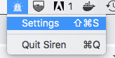

#  CalendarSiren

A little Menu Bar Application to signal persistent alarms for certain events in a calendar

## Description

I  found myself missing Zoom and Google Hangouts meetings because the normal phone calendar alarms are too subtle, especially when the phone is on silent.

When it's time to get ready for a Zoom or Google Hangouts conference call, this simple menubar app makes a lot of noise and keeps making noise until you stop it.

The app will prompt for permission to access your calendars (it only reads them).

## Usage

Click the menubar icon to open the menu:

Click _Settings_ to open the main popup user interface

Choose the Calendar you want the app to use.

That's pretty much it. The app scans for events with Zoom or Google Hangout (Google Meet) links and triggers 10 minutes before the event. To silence the app, close the popup.
